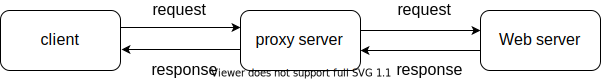

### simple-HTTP-proxy
代理服务器的工作方式如下：
- 客户端向代理服务器发送请求，表明自己需要请求的网站内容
- 代理服务器接收到来自客户端的请求之后，通过解析，获取到需要访问的web服务
- 代理服务器将客户端的请求信息全部转发给web服务器
- web服务器返回响应消息给代理服务器
- 代理服务器将返回的消息转发给对应的客户端


下面介绍一下如何使用golang搭建一个简单的HTTP代理服务器(不支持HTTPS)

#### 1. 首先，我们需要绑定一个端口监听客户端的请求，如果客户端发送请求，便进行相关处理
```go
func main() {
  // 端口号可以自己指定
	l, err := net.Listen("tcp", "127.0.0.1:8080")
	if err != nil {
		panic(err)
	}
	for {
    // 接收客户端的请求
		conn, err := l.Accept()
		if err != nil {
			continue
    }
    // 一旦建立连接，那么进行处理
		go handleConn(conn)
	}
}
```

#### 2. 解析客户端的请求信息，获取到需要访问的web服务器
```go
var request = make([]byte, MAX_BUFF_SIZE)

// 从conn中读取请求数据
n, err := conn.Read(request)
if err != nil {
  fmt.Println("read request error: ", err)
  return
}

reader := bytes.NewReader(request[:n])
r := bufio.NewReader(reader)

// 读取第一行请求数据，中间包含需要访问的服务器内容
s, err := r.ReadString('\n')
if err != nil {
  fmt.Println("read string error: ", err)
  return
}

uri := strings.Split(s, " ")[1]

// 找到 hostname, 比如  httpbin.org 而不是 http://httpbin.org/
if strings.Index(uri, "http://") > -1 {
  uri = uri[7:]
}

// 获取到服务端的主机
pos := strings.Index(uri, "/")
var hostname = uri
if pos > -1 {
  hostname = uri[:pos]
}
// fmt.Println("hostname: ", hostname)

// 获取到主机，以及端口号
colon := strings.Index(hostname, ":")
var host, port string
if colon > -1 {
  host = hostname[:colon]
  port = hostname[colon+1:]
} else {
  // 如果没有指定端口号，默认使用80端口
  host = hostname
  port = "80"
}
fmt.Printf("host: %s, port: %s\n", host, port)

```

#### 3. 转发客户端请求内容并读取服务端返回的信息，返回给客户端
```go
// 建立到想要请求的服务端的连接
c, err := net.DialTimeout("tcp", net.JoinHostPort(host, port), 30*time.Second)
if err != nil {
  fmt.Println(err)
  return
}

// 将需要请求的数据转发一份
_, err = c.Write(request)
if err != nil {
  fmt.Println("write request error: ", err)
  return
}

// 将从服务端读取到的内容全部转发给客户端
var buff [512]byte
for {
  n, err := c.Read(buff[:])
  if err != nil {
    if err == io.EOF {
      break
    }
    return
  }
  _, err = conn.Write(buff[:n])
  if err != nil {
    fmt.Println("write to client error: ", err)
    return
  }
}
```

### 进行测试
下载插件 `Proxy SwitchyOmega`，如果你使用`Edge`，见[这里](https://microsoftedge.microsoft.com/addons/detail/proxy-switchyomega/fdbloeknjpnloaggplaobopplkdhnikc)，如果你使用Google，见[这里](https://chrome.google.com/webstore/detail/padekgcemlokbadohgkifijomclgjgif)

打开插件进行配置，如下


访问一个`http`协议的网址，比如`http://httpbin.org`，如果可以访问，那么说明代理服务器生效~
> 注意无法访问https协议的网址


